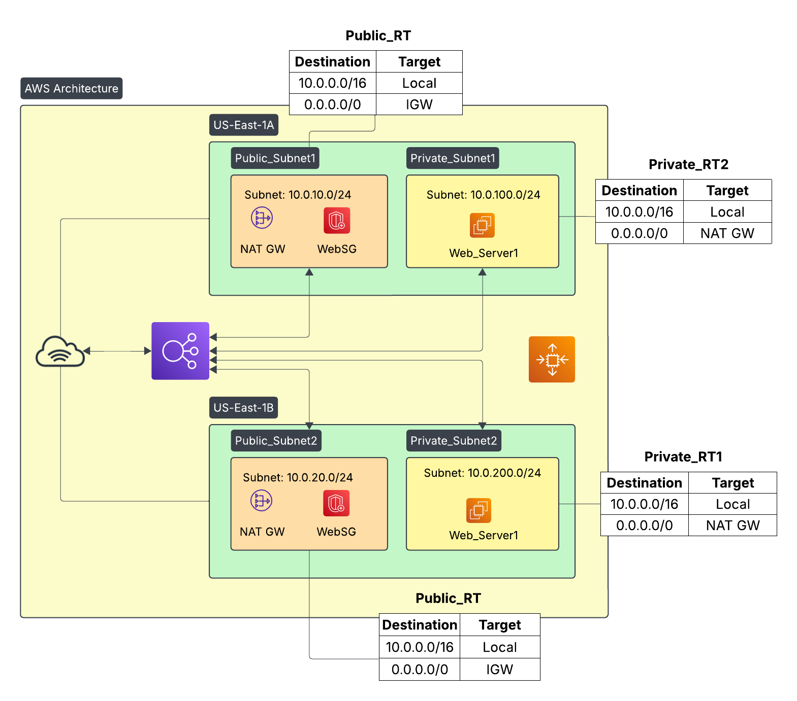

# 🚀 Deploying High Available Web App Using Terraform

This project uses Terraform to provision a scalable, highly available web application infrastructure on AWS. It includes:

- A custom VPC with public and private subnets
- NAT Gateways for private subnet internet access
- Application Load Balancer (ALB)
- Auto Scaling Group (ASG) with Launch Template
- Security Groups for Load Balancer and EC2
- Health checks and target group for routing traffic

---

## 🗺️ Architecture Diagram



---

## 📦 Components

### VPC and Networking
- Custom VPC (`10.0.0.0/16`)
- Two public subnets for the Load Balancer and NAT Gateways
- Two private subnets for EC2 instances
- Internet Gateway and two NAT Gateways (for high availability)

### Load Balancer
- Application Load Balancer (ALB)
- Target Group with health checks on port 80 (`/`)
- Listener configured to forward HTTP traffic

### Auto Scaling Group
- Launch Template installs and configures Apache (`httpd`)
- Auto Scaling Group with a desired capacity of 4 instances
- Instances are placed in private subnets

### Security
- Security Group for Load Balancer (accepts HTTP from anywhere)
- Security Group for EC2 (accepts HTTP from Load Balancer SG only)

---

## 🔧 How to Use

### Prerequisites

- Terraform >= 1.0
- AWS CLI configured (`aws configure`)
- IAM permissions to manage AWS infrastructure

### Steps

1. **Clone the repo:**
   ```bash
   git clone https://github.com/your-username/terraform-webserver-asg.git
   cd terraform-webserver-asg
   ```

2. **Initialize Terraform:**
    ```bash
    terraform init
    ```

3. **Plan the Infrastructure:**
    ```bash
    terraform plan
    ```

4. **Apply the Configuration:**
    ```bash
    terraform apply -auto-approve
    ```
